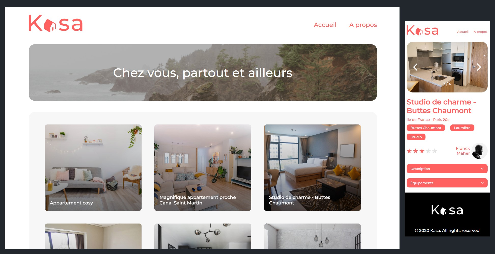

# Formation développeur web

## 📎 Projet 7 : Kasa - Agence de location immobilière



## Technologies :

### Front : 
- React
- Sass


## Installation :

Installer les dépendances avec la commande `npm install`

Démarrer le serveur avec la commande `npm start`

## Tester le projet :

```terminal
git clone https://github.com/Cyril-Develop/Kasa.git
```


