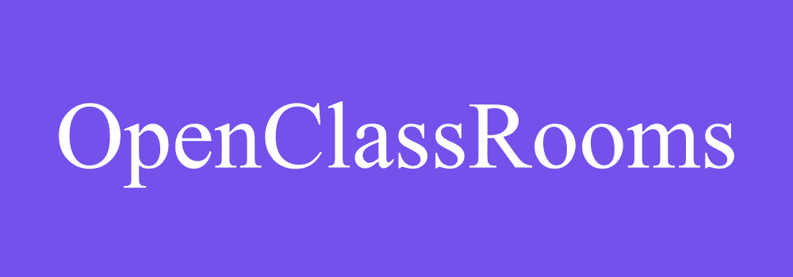
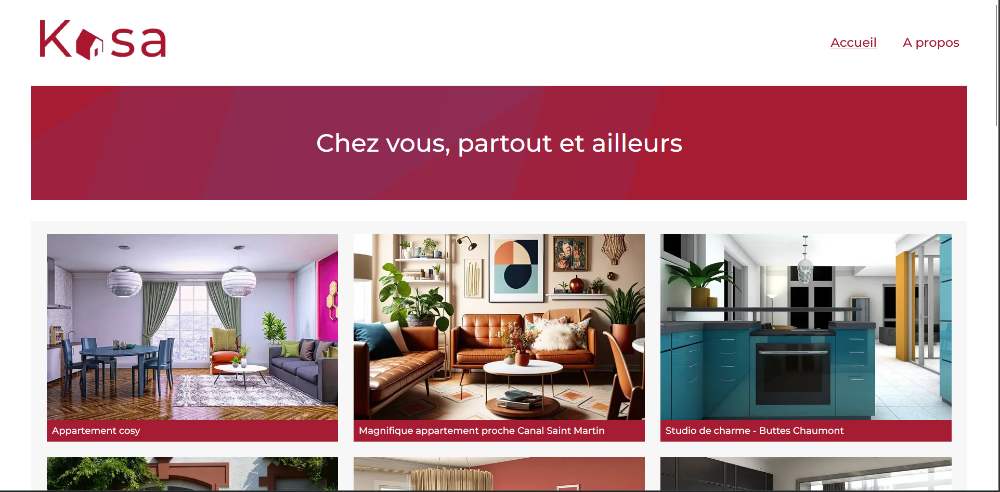

# Formation Développeur d'application - JavaScript React

## 📎 Projet 11 : Kasa - Développez une application Web avec React et React Router
## 



## Technologies :

- React
- React Router
- SASS


## Tester le projet :

```terminal
git clone https://github.com/Cyril-Develop/Kasa.git
```